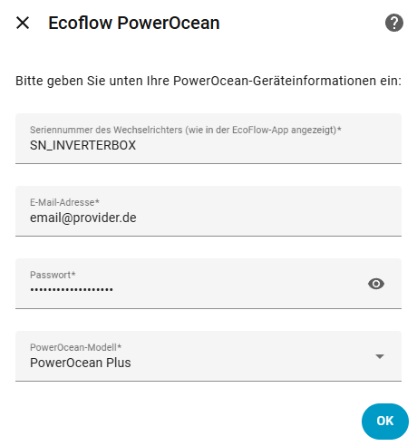
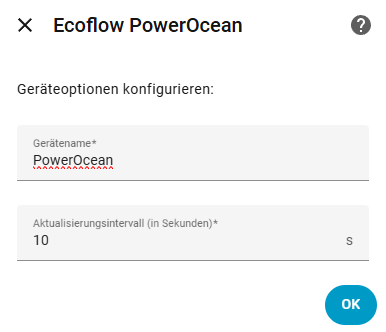
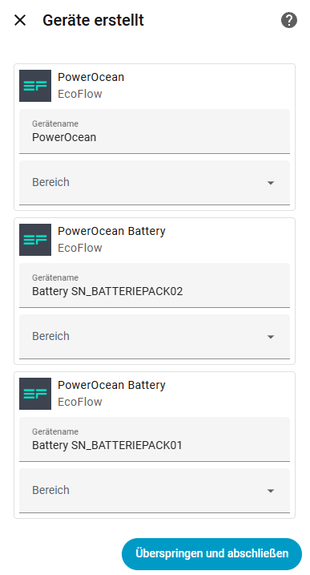

# EcoFlow PowerOcean for Home Assistant

[](https://github.com/niltrip/powerocean/releases/)
[](https://github.com/niltrip/powerocean/issues)
[](https://github.com/niltrip/powerocean)
[](https://github.com/niltrip/powerocean/commits/main)
[](https://github.com/hacs/integration)
[](https://github.com/niltrip/powerocean/actions?query=workflow:"Validate")


[Home Assistant](https://home-assistant.io/) custom component for EcoFlow PowerOcean hybrid inverter systems.

Exposes sensors, controls, and energy-flow data via the EcoFlow cloud API — no local MQTT broker or API key required.

## Features

- **60+ sensors** — power, energy, voltage, current, temperature, SoC, SoH, and more
- **Energy Dashboard** — grid import/export, solar yield, battery charge/discharge auto-discovered
- **Binary sensors** — online status, self-check faults, MPPT/EPO states
- **Write controls** — backup reserve SoC, fast-charge cap, charger power/current/mode, grid import limit, battery heating, EV charger enable/auto
- **Services** — `set_tou_schedule` (Time-of-Use JSON), `set_grid_type` (single/three-phase)
- **Auto-detection** — discovers all PowerOcean devices on your EcoFlow account after credential entry; no serial number lookup needed
- **Migration** — automatically imports entries from the original `powerocean` integration on first load
- **Multi-language** — English, German, French UI

## Supported models

| Model | Product code |
|-------|-------------|
| PowerOcean | 83 |
| PowerOcean DC Fit | 85 |
| PowerOcean Single Phase | 86 |
| PowerOcean Plus | 87 |

## Installation

### HACS (recommended)

1. Open HACS → Integrations → Custom repositories
2. Add `https://github.com/niltrip/powerocean` with category **Integration**
3. Search for **EcoFlow PowerOcean** and install
4. Restart Home Assistant

### Manual

1. Download the latest release and extract the `custom_components/powerocean_dev` folder
2. Copy it to `<config>/custom_components/powerocean_dev/`
3. Restart Home Assistant

## Setup

Go to **Settings → Devices & Services → Add Integration** and search for **EcoFlow PowerOcean**.

### Step 1 — Credentials

Enter your EcoFlow account email and password.  
The integration will attempt to detect your connected PowerOcean devices automatically.



### Step 2 — Select device

If auto-detection succeeds you will see a drop-down of your PowerOcean devices.  
Select the one you want to add.

If auto-detection returns no results (e.g. unsupported region or API change), enter the inverter serial number and model manually instead.



### Step 3 — Device options

Optionally set a friendly name and polling interval (10–60 s, default 10 s).



## Migration from the original integration

If you are already running the original `powerocean` custom integration, `powerocean_dev` will detect your existing config entries on first load and import them automatically — no manual re-entry required. The original entries are left untouched; you can remove them once you have verified the new integration works.

## Controls

| Entity | Type | Description |
|--------|------|-------------|
| Backup Reserve SoC | number | Minimum battery SoC before grid draw |
| Fast Charge Upper Limit | number | Maximum SoC during fast charge |
| Charger Power Limit | number | Max output power of the PowerPulse EV charger (W) |
| Grid Import Power Limit | number | Cap on grid draw (W) |
| Charger Current Limit | number | Max AC charging current for PowerPulse (6–32 A) |
| Charger Mode | select | Automatic / Fast / Economy |
| Backup Mode | select | Self-use / Backup / Off |
| EV Charger | switch | Enable / disable PowerPulse |
| Grid Charging | switch | Enable / disable charging from the grid |
| System Pause | switch | Pause / resume the inverter |
| Battery Heating | switch | Enable cell heating (important in sub-zero climates) |
| Automatic EV Charging | switch | Enable PowerPulse TOU / solar-priority auto mode |
| Reboot System | button | Trigger a system reboot |
| Run Self-check | button | Trigger a self-check cycle |

## Services

### `powerocean_dev.set_tou_schedule`

Write a Time-of-Use strategy as a JSON blob directly to the inverter.

```yaml
service: powerocean_dev.set_tou_schedule
data:
  schedule: '{"cfgTouStrategy": ...}'
```

### `powerocean_dev.set_grid_type`

Switch between single-phase (`0`) and three-phase (`1`) grid connection.

```yaml
service: powerocean_dev.set_grid_type
data:
  grid_type: 1
```

## Troubleshooting

Enable debug logging during initial setup:

```yaml
logger:
  default: warn
  logs:
    custom_components.powerocean_dev: debug
```

Key log messages to look for:

| Message | Meaning |
|---------|---------|
| `EMS heartbeat missing 'pcsMeterPower'` | Grid-flow sensors will read 0 W until the field appears |
| `EMS heartbeat missing 'emsBpPower'` | Battery-flow sensors will read 0 W |
| `House consumption is negative` | Possible meter sign-convention mismatch — check wiring |
| `Using mocked API response` | Test mode is active (`USE_MOCKED_RESPONSE = True`) |

## Credits

- Original concept: [tolwi/hassio-ecoflow-cloud](https://github.com/tolwi/hassio-ecoflow-cloud)
- Inspired by: [evercape/hass-resol-KM2](https://github.com/evercape/hass-resol-KM2)
- Thanks to the Home Assistant community and all contributors
